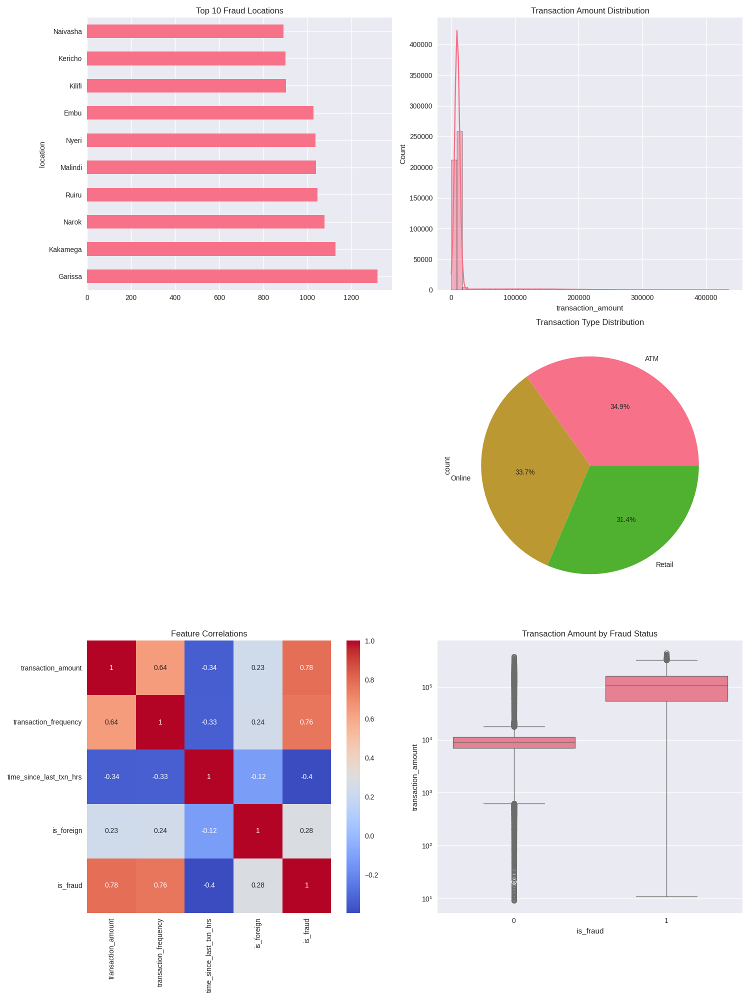
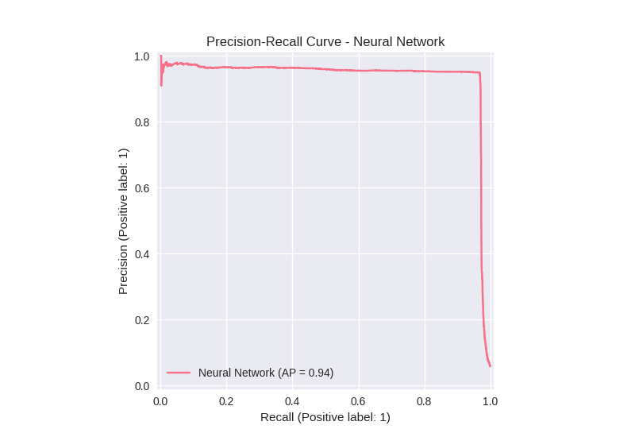
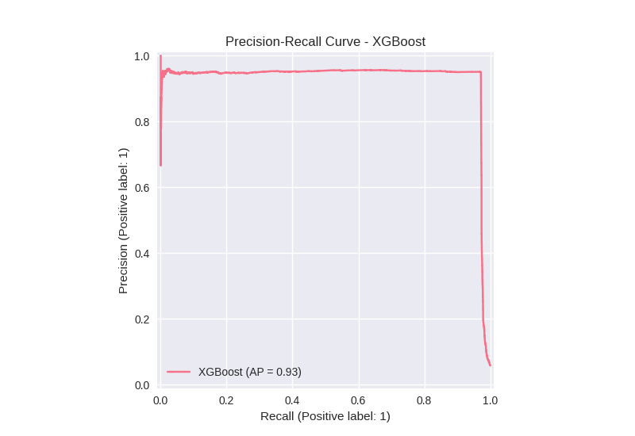
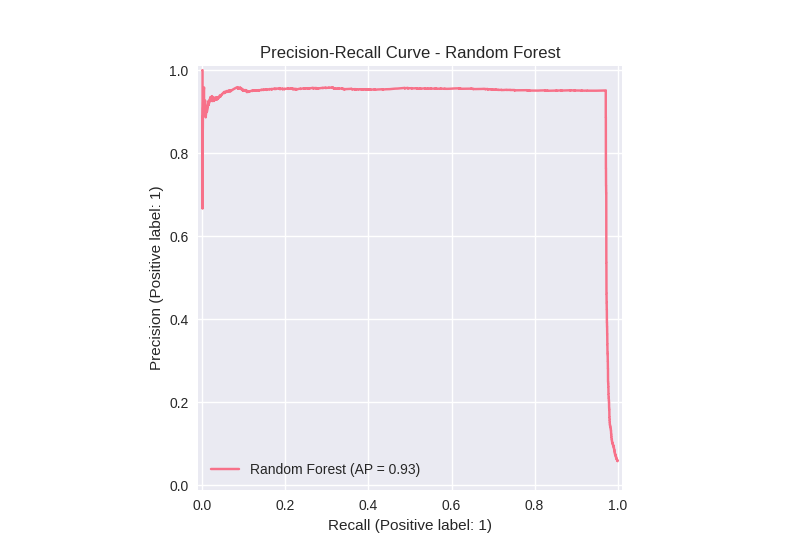
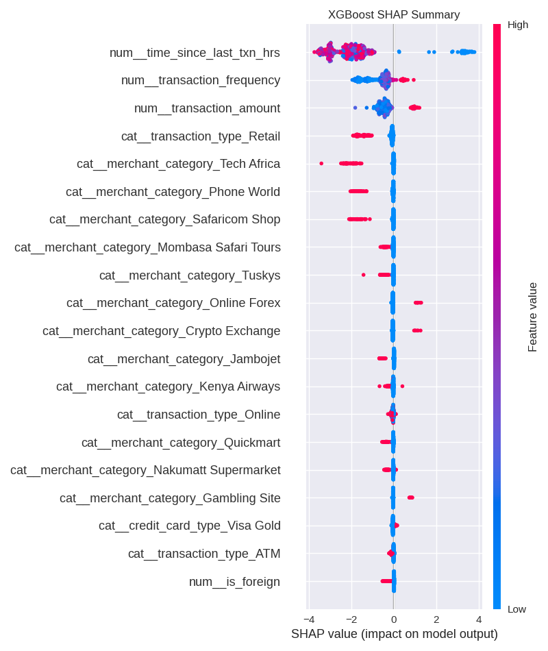

# 🔍 Kenyan Fraud Detection System


A sophisticated machine learning system for detecting fraudulent financial transactions in Kenya using synthetic data and advanced AI models.

<p align="center">
  
</p>

## 📊 Project Overview

This project demonstrates a comprehensive approach to fraud detection using synthetic Kenyan transaction data. It implements and compares multiple machine learning models, providing visualizations and actionable insights for fraud prevention in financial services.

### 🌍 Key Features

- **Realistic synthetic data generation** with Kenya-specific demographics
- **Advanced ML models**: Neural Networks, XGBoost, and Random Forest
- **Comprehensive analysis** with precision-recall curves and SHAP interpretations
- **Regional insights** for location-based fraud patterns in Kenya
- **Transaction-type analysis** for fraud vulnerability assessment

## 🗂️ Repository Structure

```
data/                  # Data files (synthetic and processed)
notebooks/             # Jupyter notebooks for data generation and analysis
src/                   # Python scripts for core functionality
  ├── data_generation.py  # Synthetic data generation
  ├── training.py         # Model training pipeline
  └── final_models.py     # Final model implementations
models/                # Saved model files
outputs/               # Visualizations and result files
```

## 🚀 Key Findings

### Top Fraud Locations
Kericho, Kilifi, and Embu are the top regions with high fraud activity.

### Transaction Patterns
- ATM transactions dominate (34.9%), followed by Retail (33.7%)
- Higher transaction amounts and frequency strongly correlate with fraud (0.76)
- Fraudulent transactions often occur shortly after legitimate ones

<p align="center">
  
  
  
</p>

### Model Performance
- Neural Network achieved the highest AP (0.94)
- Random Forest and XGBoost both performed well (AP = 0.93)

### SHAP Analysis
Key fraud indicators include transaction amount, frequency, and merchant categories like Tech Africa and Online Forex.

<p align="center">
  
</p>

## 🛠️ Getting Started

### Prerequisites

- Python 3.8+
- Required packages listed in `requirements.txt`

### Installation

```bash
# Clone the repository
git clone https://github.com/ARMSTRONGOPONDO/DATA-SCIANCE.git
cd DATA-SCIANCE

# Create a virtual environment (optional but recommended)
python -m venv venv
source venv/bin/activate  # On Windows: venv\Scripts\activate

# Install dependencies
pip install -r requirements.txt
```

### Usage

1. **Generate synthetic data**:
```bash
python src/data_generation.py
```

2. **Run model training**:
```bash
python src/training.py
```

3. **Evaluate and visualize final models**:
```bash
python src/final_models.py
```

4. **Explore Jupyter notebooks** for detailed analysis:
```bash
jupyter notebook notebooks/
```

## 📈 Model Comparison

| Model           | Average Precision | Key Strengths                        |
|-----------------|-------------------|--------------------------------------|
| Neural Network  | 0.94              | Best overall performance             |
| XGBoost         | 0.93              | Excellent feature importance insights|
| Random Forest   | 0.93              | Good balance of metrics              |

## ⚠️ Disclaimer

The data used in this project is synthetic and generated for demonstration purposes. While it incorporates realistic patterns based on Kenyan demographics and transaction behaviors, it is not statistically accurate for real-world deployment without further validation.

## 📜 License

This project is licensed under the MIT License - see the LICENSE file for details.

## 📬 Contact

Armstrong Opondo - [@ArmstrongOpondo](https://github.com/ARMSTRONGOPONDO)

---

<p align="center">
  <i>Built with ❤️ for the Kenyan financial technology sector</i>
</p>
